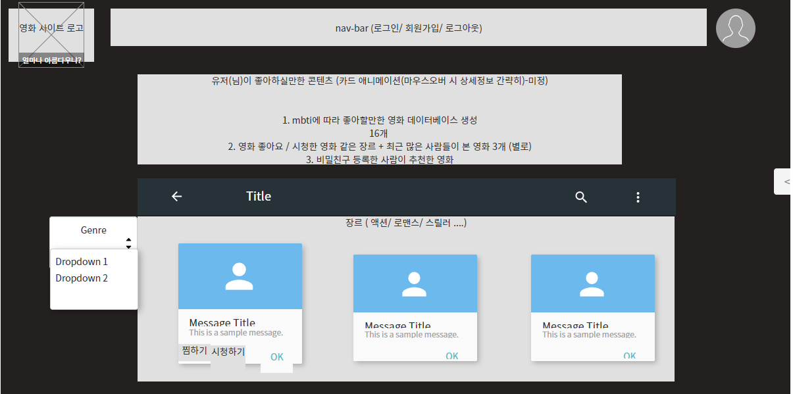
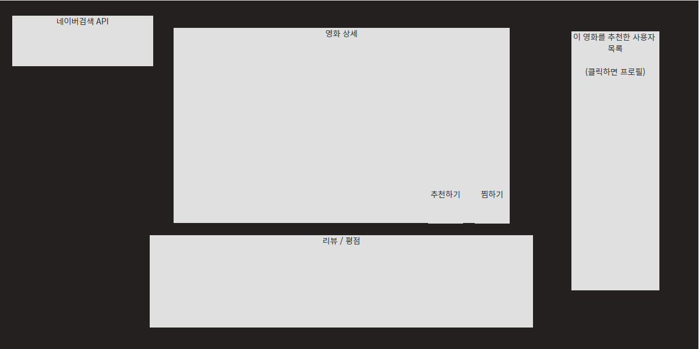
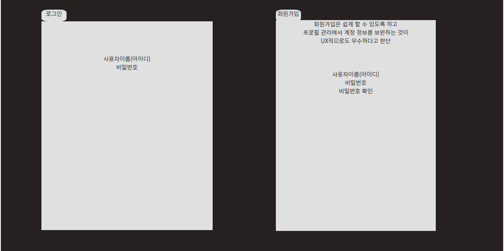
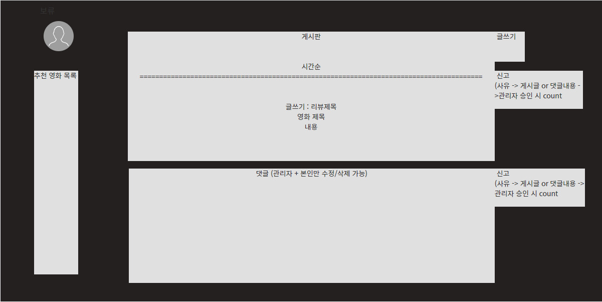
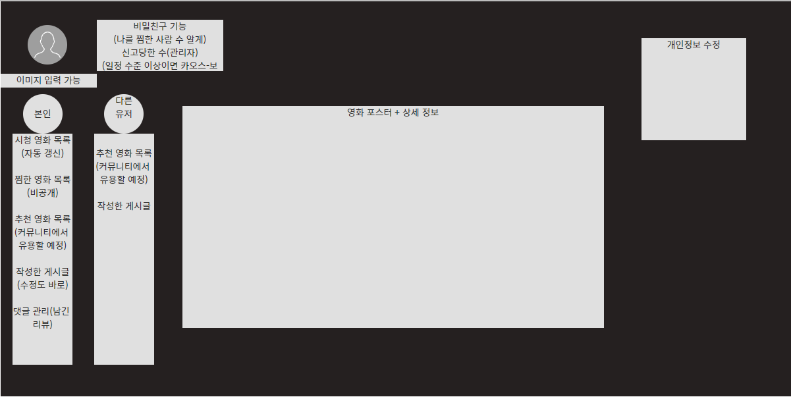
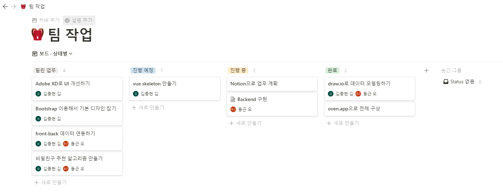
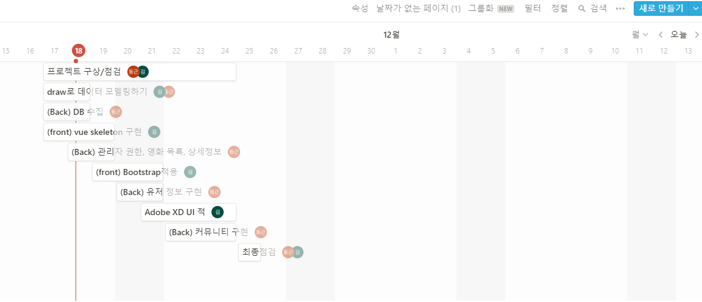
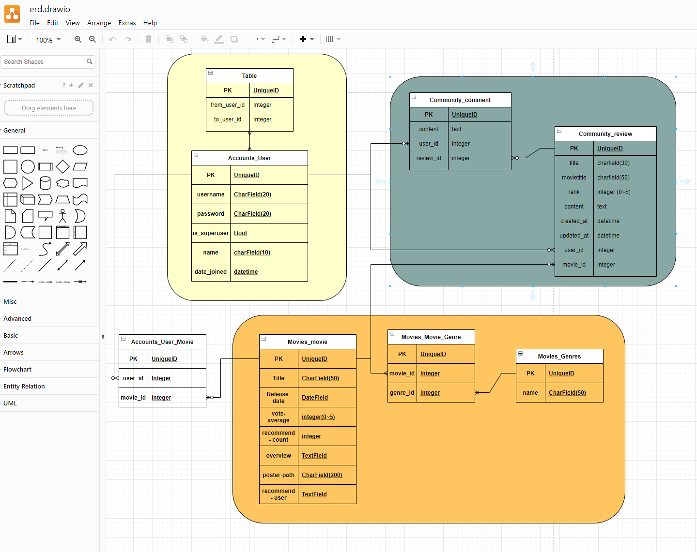

# 구미 2반 김종현

## 11. 17. 수요일

### Prototype by oven

- 내가 맡은 부분은 front-end이다. prototype을 페어와 회의하면서 만들었고 vue, bootstrap, adobe XD를 활용하여 제작해볼 예정이다.

### Scheduling by notion

- notion을 활용하여 아래와 같이 할일들을 정리하고 각자 일정에 맞춰 계획을 세웠다.

### modeling by draw

- 페어와 함께 draw.io를 활용하여 데이터 모델링을 수행하였다.

## 11. 18. 목요일

### make basic template by vue & vuex

- Router Link를 활용하여 nav bar를 구현하였다.
- Login/Signup 페이지의 화면 구성을 간단하게 만들었다.
- Home 페이지를 영화 추천 컴포넌트와 전체 영화를 조회하는 컴포넌트로 나누어 구성하였다.
- 영화 추천 컴포넌트는 Transition과 hover를 사용하여 애니메이션을 구현하였다.
- 그리고 이미지 클릭 시 detail 페이지로 넘어가지도록 설계하였다.

## 11. 19. 금요일

- 오늘은 기본적인 뼈대를 어제에 이어서 마무리하였다.(게시판, 게시글 상세, 프로필, 사이드바)
- Movie-Genre 데이터를 TMDB에서 가져와서 만드는데 어려움이 있었다. Movie가 갖고 있는 genre_ids가 여러개인데 id는 하나밖에 적용할 수 없기 때문에 데이터를 가져오는 과정에서 중개 테이블을 만들어줘야 할 것 같은데 방법이 마땅히 떠오르지 않았다. 내일 마무리를 해볼 예정이다.
- 내일은 백에서 데이터를 받아서 프론트에 적용시키는 작업을 해 볼 예정이다.

## 11. 20. 토요일

- 수요일에 협업을 통해 프로젝트를 설계하고 계획하였다면 목금에는 분업을 통해 back과 front의 틀을 잡았다.
- 오늘은 다시 협업을 통해 vue-django 간 데이터 연동을 시도했다.
- 오늘 목표는 user와 movies 데이터를 모두 연동시키는 것이었으나 생각치 못한 난관을 만나서 user데이터 연동에만 성공했다.
- user데이터 연동 시 마주한 첫번째 난관은 signup 시 발생한 "broken pipe error" 였다. 5개월의 시간동안 처음 만나보는 에러라 도대체 뭐가 문제고 어떻게 해결해야 하는지 구글링을 통해 파헤치고 해결하기까지 거의 3시간은 걸린 것 같다. broken pipe error 우선 앞선 요청이 끝나지 않았는데 중복해서 빠르게 요청을 재시도할 때 발생하는 오류라고 한다. 나는 signup을 한번 요청했는데 왜 이 에러가 발생하는지 도무지 알 수가 없었다. 하지만 약 3시간에 걸친 구글링 끝에 stackoverflow에서 나와 같은 상황에 놓인 사람의 글을 발견할 수 있었고 단 한 줄의 답변을 발견했다. " remove form tag, it solves that problem. "...결과는 너무나 허무하게도 vue template에서 form 태그를 사용해서 발생한 에러였다...
- 두번째 난관은 jwt를 적용하면서 발생했다. 우리는 교재에 나와있는대로 똑같이 jwt를 적용했는데 로그인 시 계속해서 unauthorized 401에러가 발생했다... 놓친 부분이 있는지 교재를 계속해서 처음부터 다시 보고 교재에는 답이 없는 것 같아서 예전 강의까지 다시 찾아가서 놓친부분이 있는지 처음부터 끝까지 다시 들어도 보았다. 그런데 아무리봐도 문제될 부분이 전혀 없었다.... 결국 찾은 곳은 다시한번 구글링!(구선생님 당신이 없었으면 나는...ㅠ) 이것도 너무나 어처구니 없는 문제였다. django의 accounts/urls.py에 obtain jwt에 해당하는 url이 교재에는 분명 'api-token-auth/'로 되어있는데 이거를 'api/token/'으로 바꾸니까 정상적으로 작동했다. 아마도 url에 -를 사용한 게 문제가 아닐까 추정하는데 교수님 컴퓨터의 설정과 내 컴퓨터 설정이 달라서 발생한 에러인 것 같다... 이 문제를 해결하니 두어시간 넘게 지나 있었고 그렇게 movie 데이터는 내일 도전하기로 결정했다...
- user 데이터 연동은 수업을 했던 부분이기에 금방 끝낼 수 있을거라고 생각했는데 예상치 못한 변수에 너무 오랜 시간을 할애하게 되었다. 그래서 계획했던 다른 옵셔널한 부분에서 포기해야할 부분들이 생길 것 같다.  하지만 에러를 해결하는 과정에서 결국에는 답을 찾아냈기 때문에 좋은 경험이라고 생각한다. 이런 경험은 수업으로 배울 수 없는 내용이기 때문에 답을 끝내 못찾았다면 잠 못 이루었겠지만 어찌됬든 답을 찾아냈기 떄문에 잠은 맘 편히 잘 수 있을 것 같다!

## 11. 21. 일요일

- 오늘은 어제의 여파로 심신미약 상태에서 출발했다... 딱 어느정도까지 해보자라는 목표없이 되는데까지 최대한 해야하는 상황이어서 의식의 흐름대로 작업을 시작했다. 결과적으로 movie 데이터와 review 데이터를 백엔드에서 만들어서 app이 실행될 때 front의 sotre로 가져오는 작업을 처리했다. 오늘도 역시나 수많은 에러 앞에 좌절했지만 결국은 만들어 냈다... 답을 찾아내는 과정은 힘들지만 딱 찾아냈을 때의 희열은 고통에 비례하는 것 같다. 이게 개발자라는 직업이 갖는 매력이 아닐까..!?
- 처음 설계는 완벽하고 아름다운 사이트를 하나 완성하는 것이었지만 이제 목표는 굴러만이라도 가게 만드는 것이 되버렸다...ㅠㅠ

## 11. 22. 월요일

- 오전에 review detail에서 글쓴이를 클릭하면 user data를 가져와서 router parameter로 넘겨주고 그 데이터를 받아서 page를 시현하는 작업을 했다. 이 작업을 위해 modelserializer에 하위 modelserializer를 추가해서 user_id가 아닌 username을 데이터로 넘겨받을 수 있게 만들었다. 수업 때 분명 배웠던 내용인데 전혀 이 상황에 적용해야 한다는 생각을 못했고 다행히도 페어가 이 방법을 기억해내서 문제를 나름 빨리(?) 해결할 수 있었다. 다시 한번 협업의 중요성을 느낄 수 있었다.
- 페이지 간에 데이터 이동이 복잡하게 되어가고 있다. 그럼에도 새로 makemigrations하는 일이 없이 작업이 척척은 아니지만 우당탕탕이라도 진행되고 있는 걸 보니 초기 모델링을 잘 해놓는 것이 얼마나 중요한지 다시 한번 깨닫게 된다!

- 오후에는 게시판 기능을 완성하고 영화 추천하기 버튼을 만들었다.
- 프로필에서 현재 로그인한 유저가 누구든 간에 보여줘야 할 부분은 프로필 유저가 추천한 영화 / 게시한 리뷰 이 두가지 이고 프로필 유저 = 로그인한 유저일 때는 개인정보 수정이다. 추가로 비밀친구도 로그인 유저가 누구냐에 따라 전자는 비밀친구 맺기 버튼이 있어야 하고 후자는 나를 비밀친구로 몇명이 맺고 있는지 확인 가능하게 만들어야 한다. 오늘은 로그인 유저 != 프로필 유저인 경우까지 완성했고 내일 마무리할 예정이다.

